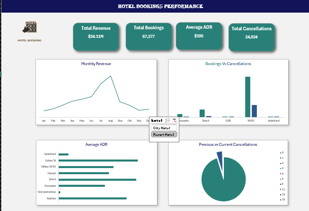

# 📊 Task 2 – Exploratory Data Analysis (EDA) & Business Intelligence

## 🧭 Objective
To uncover patterns, trends, and relationships within the **Hotel Booking Demand Dataset** and develop proficiency in **SQL** for data extraction and dashboard creation.  

This task builds upon the **cleaned dataset prepared in Task 1**, ensuring accurate and consistent data for analysis.

---

## 🪜 Steps & Methodology

### 1️⃣ Descriptive Statistics & Univariate Analysis
- Calculated summary statistics for numerical and categorical fields.  
- Visualized distributions using histograms and bar charts.  
- **Key columns analyzed:**
  - Numerical: `lead_time`, `stays_in_week_nights`, `stays_in_weekend_nights`, `adults`, `children`, `babies`, `adr`
  - Categorical: `hotel`, `meal`, `market_segment`, `distribution_channel`, `customer_type`, `deposit_type`, `is_canceled`

### 2️⃣ SQL for Business Questions
Developed and executed SQL queries to answer business‑driven questions:
- Monthly Revenue  
- The Cancellation Problem by Distribution Channel  
- Lead Time Impact on Cancellations  
- Top 5 Guest Origin Countries  
- Market Segment Behavior Analysis  
- Repeated Guests vs. Cancellations  

### 3️⃣ Multivariate Analysis & Correlation
Explored relationships between multiple variables using advanced visualizations:
- Scatter plots (`lead_time` vs `adr`, colored by `is_canceled`)  
- Market Segment vs ADR (Box Plot)  
- Heatmap of correlations among numerical features  

### 4️⃣ Static Dashboard Mock‑Up
Created a static dashboard (PowerPoint / Google Slides / Excel) summarizing key KPIs:
- Total Bookings  
- Total Cancellations  
- Average ADR  
- Total Revenue  

---

## 📈 Insights & Findings
- City Hotels show higher cancellation rates compared to Resort Hotels.  
- Longer lead times correlate with higher ADR values.  
- Most bookings occur between July and August.  
- Corporate and Online TA segments contribute the highest revenue.  
- Average stay length is shorter for transient customers.  

---

## 📂 Repository Structure
Task2_EDA/
│
├── EDA(descriptive,univariate and multivariate analysis).ipynb   # Jupyter Notebook with Python EDA
├── sql_queries.sql                                               # SQL queries for business questions
├── dashboard.xlsx                                                # Static dashboard (Excel)
├── dashboard.png                                                 # Static dashboard image
└── sample_cleaned_hotel_bookings                                 # Sample cleaned dataset from Task 1

## 🧠 Tools & Technologies
- Python (Pandas, NumPy, Matplotlib, Seaborn)  
- SQL (MySQL)  
- Excel (for dashboard)  

---

## 📊 Dashboard Preview

---

## 📢 Acknowledgment
Grateful to **Apex Planet Software Solutions Pvt Limited** for the guidance and opportunity to enhance my practical knowledge in **Data Analytics** and **Business Intelligence**.
